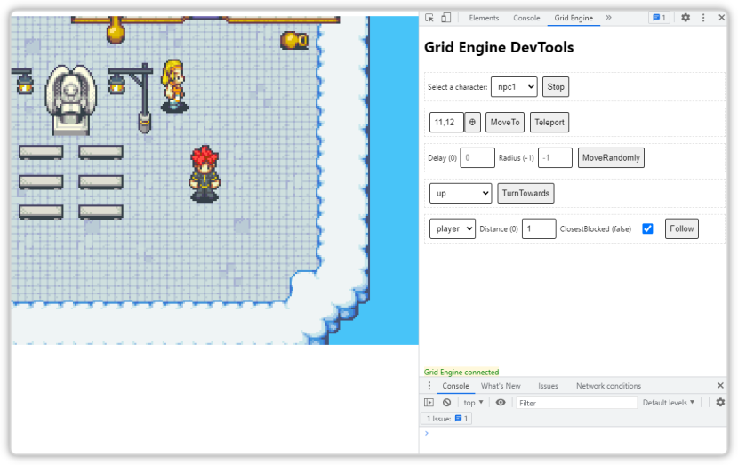

# Grid Engine DevTools

This is a Chrome DevTools extension for the [Grid Engine plugin for Phaser 3](https://annoraaq.github.io/grid-engine/).

Install the extension in the [Google Chrome Web Store](https://chrome.google.com/webstore/detail/grid-engine-devtools/moplhbafnakhjjehlmpedbmbomcmgope)

## How to use?
When creating your scene, make sure to expose your gridEngine instance via `window.__GRID_ENGINE__`. (see `public/game.js` for an example).

After that open the DevTools and navigate to the new panel `Grid Engine`.

## Ideas? New Features?
Let me hear your feedback and ideas. Create an issue and let's discuss.
